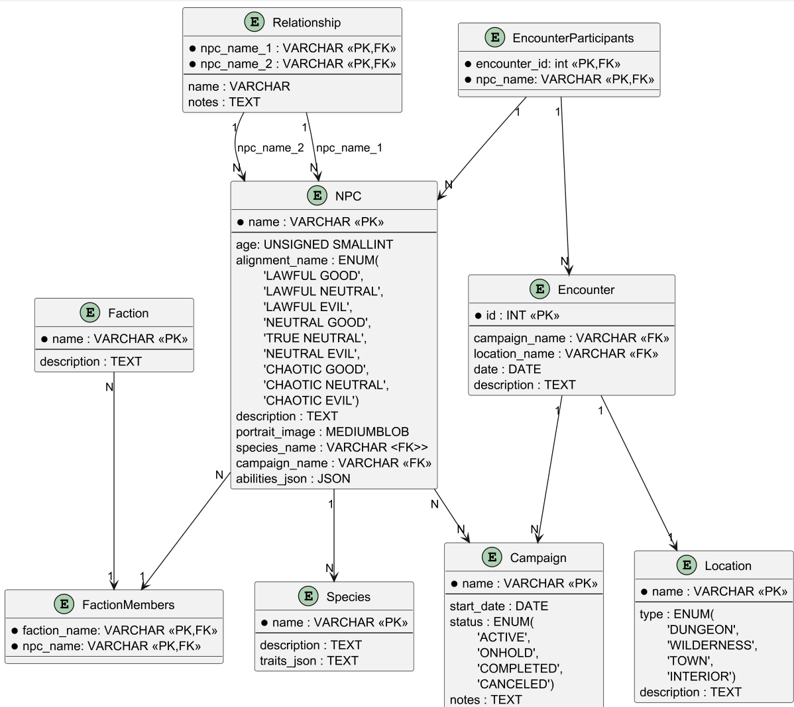
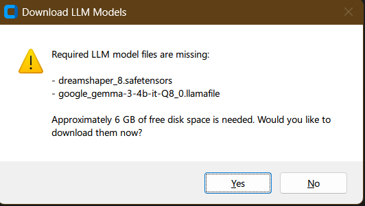
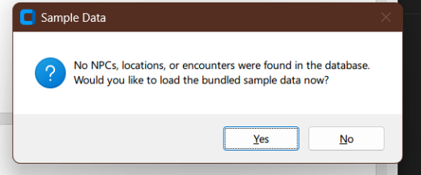
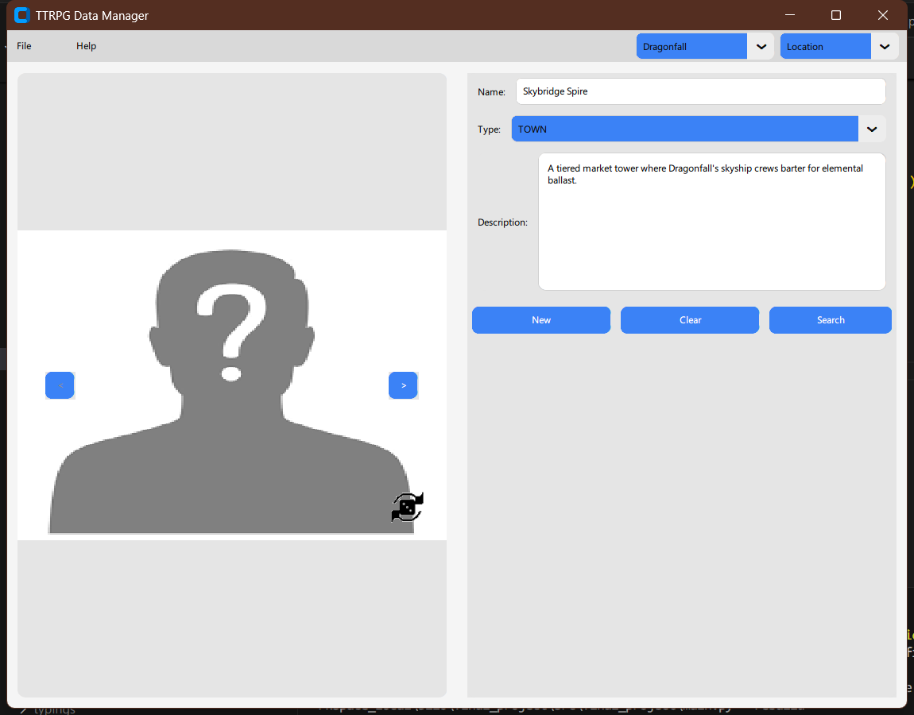
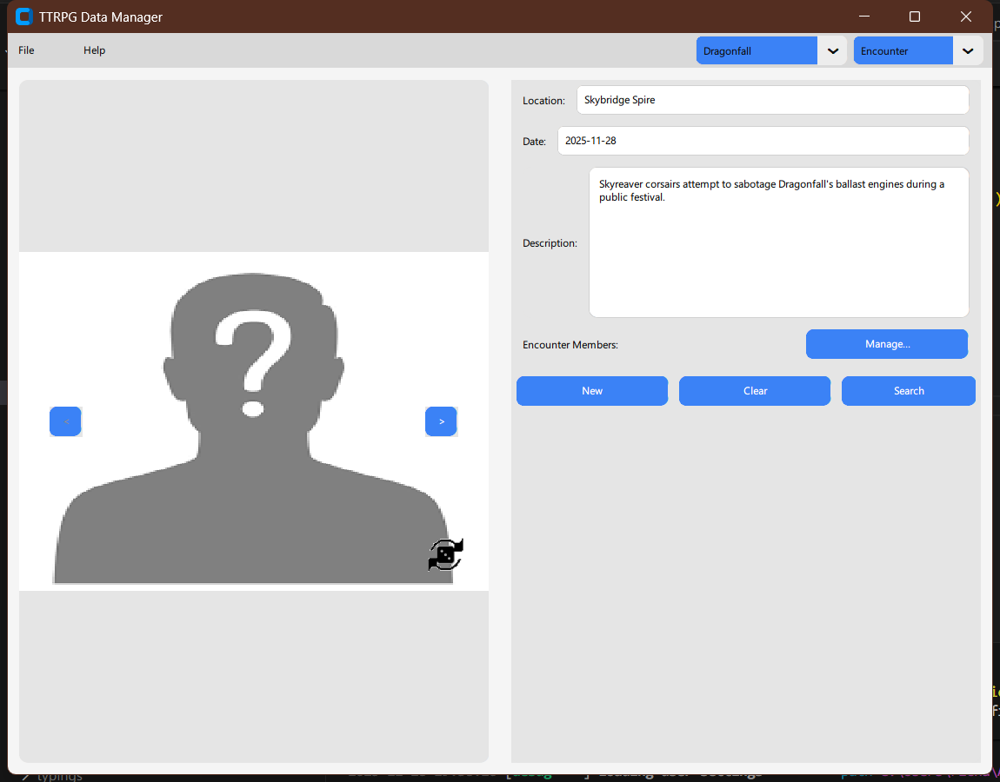
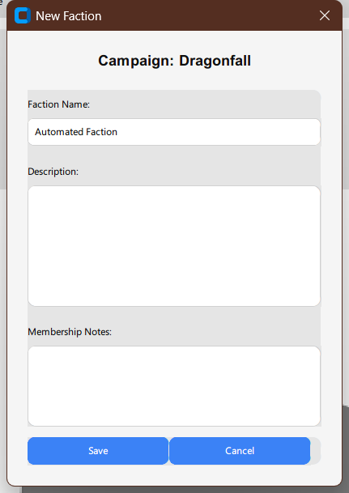
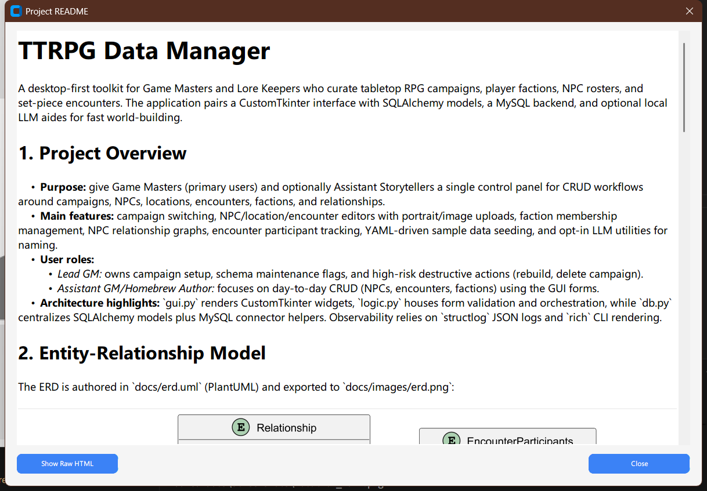

# TTRPG Data Manager

A Desktop based program for Game Masters, Store Tellers or Authors need to manage TTRPG games or store information. The application uses a CustomTkinter interface, SQLAlchemy models backed by [ysaqml](https://github.com/rbroderi/ysaqml) (YAML persisted to disk, SQLite in-memory at runtime), and optional local LLM files to help construct images and names.

## 1. Project Overview
- **Purpose:** give Game Masters and Authors a single control panel for CRUD workflows around campaigns, NPCs, locations, encounters, factions, and relationships.
- **Main features:** 
  - Campaign switching
  - NPC/location/encounter editors with portrait/image uploads/downloads
  - Faction membership management
  - NPC relationship tracking
  - Encounter participant tracking
  - YAML-driven sample data loading
  - Local offline LLM capabilities for generating names and images.
- **User roles:**
  - *GMs/ Story Tellers / Authors:*
    - They perform CRUD operations inside the GUI
		- Adds portraits, relationships, and faction notes.
- **Architecture highlights:** 
  - `gui.py` renders CustomTkinter widgets
  - `logic.py` houses form validation and orchestration
  - `db.py` centralizes SQLAlchemy models and engine/session helpers
  - Observability relies on `structlog` JSON logs.

## 2. Entity-Relationship Model
The ERD (authored in `docs/erd.uml`, rendered to `docs/images/erd.png`) illustrates how campaign-scoped records share the same base table and how imagery is centralized:



- `CampaignRecord` is the abstract anchor. `NPC`, `Location`, and `Encounter` inherit from it (joined-table inheritance), so they share the same integer PK, the `campaign_name` FK, and a discriminator column. Cascading deletes flow through this single FK because every derived row ultimately hangs off the base table.
- `Campaign` sits at the top of the hierarchy, with the 1→N edge into `CampaignRecord` representing every record that belongs to a campaign. Specialized tables store only their unique attributes.
- `ImageStore` is a 0→1 with `CampaignRecord`. Any inheriting entity can opt into having a binary image without bloating its own table. Portraits, location art, and battlemaps all land in this shared LONGBLOB table keyed by the campaign record id.
  - This retains the possibility to store this data elsewhere in the future.
- `NPC` references `Species`, exposes enum columns (alignment, gender), and participates in each associative table. Because the campaign linkage is inherited, join tables (`FactionMembers`, `EncounterParticipants`, `Relationship`) automatically scope themselves to the same campaign through their FK targets.
- `Location` and `Encounter` inherit through the same base table; `Encounter` also references `Location`, forming the Campaign→Location→Encounter chain while keeping the FK path to Campaign consistent.
- Join tables enforce composite PKs/unique constraints so every NPC-faction, NPC-encounter, or NPC↔NPC relationship pair remains unique.

## 3. Schema Management
- **Source of truth:** SQLAlchemy models inside `db.py` define the schema. `data/db.ddl` remains in the repo as a historical reference but the application no longer executes it.
- **Deployment:** `setup_database()` now builds a `ysaqml` engine which keeps an in-memory SQLite database in sync with YAML files stored under `data/db/` (path configurable via `data/config.toml`). Foreign keys are enabled on every connection and `--rebuild` drops the live tables so the YAML snapshots are rewritten before exit.
- **Structure:** Tables declare explicit PKs/FKs, enumerations, and indexes just as before: `npc`/`location` stay unique per campaign/name, `encounter` is unique per location/date/campaign, and join tables retain composite keys.
- **Referential constraints:** Cascades are enforced through the ORM metadata. Campaign-scoped entities cascade on update/delete, join tables cascade to their parents, and `species` remains `ON DELETE RESTRICT`.
- **Checks and enumerations:** Enum columns model the gender/alignment/location/campaign status choices. The underlying SQLite engine (running entirely in-memory) still enforces CHECK constraints (e.g., `age BETWEEN 0 AND 65535`), while higher-level validation happens in the GUI/logic layer.
- **Configuration location:** `data/config.toml` holds the SQLAlchemy URL pieces (the `ysaqml` driver plus the YAML directory). No `.env` or external credential management is required for the bundled YAML-backed database.

## 4. CRUD Guide
Each workflow is reachable through the CustomTkinter sidebar tabs or CLI flags. Below is a quick reference tying screens to tables:

- **Campaign management (Menu bar → Campaign selector):** touches `campaign`, and when deleting it cascades to `npc`, `location`, `encounter`, `faction`, `faction_members`, `relationship`, and `encounter_participants`.
- **NPC editor (Sidebar → NPC):** creates/updates rows in `npc`, optionally adds `species` and `campaign` via lookups, stores portrait blobs, and affects `faction_members` or `encounter_participants` when secondary dialogs are used.
- **Location editor (Sidebar → Location):** writes to `location`, references `campaign`, and seeds encounter dropdowns.
- **Encounter editor + Participants dialog:** inserts into `encounter` (campaign/location FKs) and `encounter_participants` for NPC assignments with notes.
- **Faction workspace:** CRUD on `faction` and `faction_members`. The GUI enforces single-membership semantics by clearing prior rows before inserting a new assignment.
- **Relationship dialog:** manipulates the `relationship` join table to capture mentor/rival connections between two NPCs from the same campaign.
- **Sample seeding prompt:** 
  - When the core tables are empty the GUI offers to import all bundled YAML fixtures in one click
  - `--list-npcs` remains available for quick CLI inspection and prints a tabular view (NPC, campaign, faction, relationships).

## 5. Run Instructions
1. **Prerequisites:** Python 3.13+, `uv`, and (optionally) `.llamafile` models in `assets/` if you want AI-generated names. The YAML files under `data/db/` hold all persistence, so no external database server is required.
2. **Install dependencies:**
  ```shell
  pip install uv
  git clone https://github.com/rbroderi/TTRPGDataManager.git
  ```
  or
  ```shell
  unzip supplied zip to TTRPGDataManager/
  ```
  ```shell
  cd TTRPGDataManager
  uv sync
  ```
  Possible platform specific dependencies
  ```shell
    LINUX
    sudo apt-get install -y cmake ninja-build tk-dev tcl-dev

    MACOS
    brew install cmake ninja tcl-tk python@$3.13 python-tk@3.13 pkg-config
  ```

3. **Launch the GUI:**
  ```powershell
  uv run python -m ttrpgdataman
  ```
4. **Download Local LLM Files (optional but required for name and image generation)**
  - 

5. **Load Sample Content (optional but recommended):** when the GUI detects an empty database it shows a "Sample Data" prompt—choose **Yes** to ingest every bundled NPC, location, and encounter.
  - 

## 7. Testing & Validation Notes
- **Pytest suites:**
  - `just pytest` (or `uv run pytest`) executes the unit tests
  - GUI-adjacent tests under `tests/test_dialogs.py` exercise the CustomTkinter dialogs headlessly (Settings/Relationships/Encounters/Campaign)
  - Additional suites (`tests/test_db*.py`, `tests/test_settings_manager.py`) cover persistence helpers and default-setting flows. Use `just coverage` to run the same suite with coverage enabled.
- **Structural tests:** `uv run python -m ttrpgdataman.main --list-npcs` confirms the ORM can read data.
- **Constraint verification:** running `python -m ttrpgdataman.main --rebuild` followed by deleting a campaign in the GUI validates manual cascade logic—the referenced NPCs, relationships, faction members, and encounter participants are removed without FK violations.
- **Static analysis & type safety:**
  - `uv run ruff check src/ttrpgdataman` / `uv run ruff format src/ttrpgdataman`
  - `uv run mypy src/ttrpgdataman` (strict mode configured in `pyproject.toml`)
  - `uv run pyright src/ttrpgdataman` when cross-validating typings
- **Manual GUI tests:** launch the GUI, create/edit NPCs, attach images, assign factions, add encounter participants, and ensure the resulting rows appear under `--list-npcs`. Test LLM-driven name and image generation if `assets/*` model files are present.

## Reference Material
- `docs/erd.uml` and `docs/images/erd.png` — ERD source + rendered asset.
- `docs/proposal.pdf` — original requirements.
- `data/sample_*.yaml` — sample content used by CLI seeders and GUI demos.

## Screenshots
The `scripts/capture_ui_screens.py` automation rebuilds the database, loads the GUI, and saves the latest UI captures to `docs/images/screenshots/`. Key frames:

- **Sample data onboarding:** prompt + summary captured while seeding the bundled fixtures.
  - 
  - 
- **Core editors:** NPC, Location, and Encounter forms each with sample data loaded.
  - 
  - 
  - 
- **Auxiliary dialogs:** relationship manager (Tabular data via joins), faction creation dialog, README preview, and Settings window.
  - 
  - 
  - 
  - 

## CLI Reference

Run `uv run python -m ttrpgdataman [options]` (or `python -m ttrpgdataman` if the
environment is already active) and combine the following flags as needed:

- **`-m, --readme`** – Render this README in the terminal and exit.
- **Logging verbosity** (mutually exclusive): `-v/--log-warning` (errors),
  `-vv/--log-info` (info), `-vvv/--log-debug` (debug). Default is `ERROR`.
- **`--rebuild`** – Drop every table in the in-memory database and, on shutdown, rewrite the YAML files under `data/db/` so the on-disk state matches the empty schema.
- **`--list-npcs`** – Print every NPC currently in the database as a GitHub-style table showing the campaign, faction (with notes), and relationship links (requires connectivity).

If no maintenance flags are supplied, the CLI launches the CustomTkinter GUI.