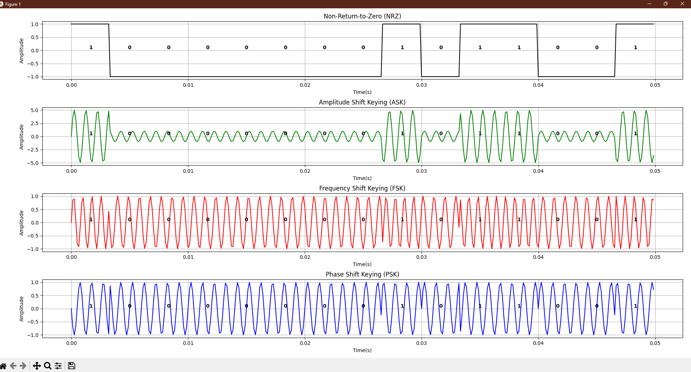
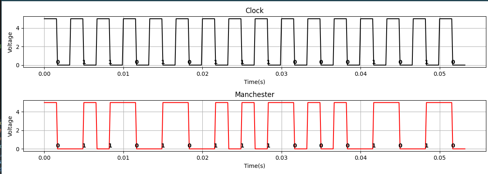

# TTRPG Data Manager

A desktop-first toolkit for Game Masters who need to curate tabletop RPG campaigns, NPCs, encounters, and related lore. The application pairs a CustomTkinter user interface with a SQLAlchemy-powered MySQL backend, optional local LLM helpers, and a fully typed Python 3.13 codebase.

## Project Overview
- Full-stack stack: `src/final_project/gui.py` renders the CustomTkinter UI, `logic.py` handles validation/state, and `db.py` encapsulates SQLAlchemy models plus all persistence helpers.
- Features: NPC/location/encounter editors, campaign-aware filtering, faction membership, NPC-to-NPC relationships, encounter participant tracking, portrait uploads, and an asynchronous local-LLM name generator (`llmrunner.py`).
- Sample YAML fixtures under `data/` plus a color theme (`data/sun_valleyish.json`) let the app boot with meaningful content and branding out of the box.
- Observability: `structlog` emits JSON logs, `rich` renders CLI output, and `lazi` keep startup costs low by deferring optional imports until they are needed.
- Tooling: `pyproject.toml` targets Python 3.13, uses `uv` for dependency resolution, and defines extras for dev, windows, and optimized MySQL client builds.

## Data Model & ERD
The ERD is documented in `docs/prelimERD.uml` (PlantUML source) and rendered to `docs/prelimERD-eps-converted-to.pdf`. The schema centers around the following tables:

| Entity | Purpose | Key Relationships |
| --- | --- | --- |
| `Campaign` | Top-level container with `start_date` and `status`. | One-to-many with `Location`, `Encounter`, `Faction`, `NPC`. |
| `NPC` | Core character record with gender/alignment enums, a portrait blob, species/campaign FK, and `abilities_json`. | Participates in `FactionMembers`, `EncounterParticipants`, and the `Relationship` self-join. |
| `Location` | Describes a place with a constrained `type` enum and optional image blob. | Linked to `Campaign` and `Encounter`. |
| `Encounter` | Schedules story beats with date, description, reference imagery, and ties to a campaign and location. | Many-to-many with NPCs via `EncounterParticipants`. |
| `Species`, `Faction` | Lookup tables with descriptive text/traits JSON for species and optional campaign scope for factions. | Feed into NPCs and faction membership. |
| `FactionMembers`, `EncounterParticipants`, `Relationship` | Join tables that enforce composite PKs and cascade semantics handled manually in `db.delete_campaign`. | Provide many-to-many mappings with additional metadata (`notes`, relation `name`). |


## Schema & DDL Automation (`src/final_project/db.py`)
- Configuration comes from `config.toml` plus secrets in `.env` (`DB_USERNAME`, `DB_PASSWORD`). `DBConfig` (Pydantic) validates inputs before building a SQLAlchemy `URL` for `mysql+mysqlconnector`.
- `setup_database()` calls `Base.metadata.drop_all()` when `--rebuild` is passed and always follows with `create_all()`, ensuring migrations are reproducible even on a blank instance.
- Images live in LONGBLOB columns (`LongBlob = LargeBinary(length=(2**32) - 1)`), while ability blocks and species traits are stored as JSON/TEXT, keeping the schema flexible for narrative data.
- Helper functions (`create_sample_npc`, `create_sample_location`, `create_sample_encounter`, `load_all_sample_data`) translate YAML fixtures into consistent rows, deduplicate by key columns, and gracefully handle missing files.
- Manual cascade helpers (`delete_campaign`, `assign_faction_member`, `delete_encounter_participant`, `save_relationship`, etc.) ensure referential integrity without relying on database-level cascade deletes, which keeps behavior consistent across local MySQL and CI setups.

```python
class NPC(Base):  # src/final_project/db.py
    __tablename__ = "npc"
    id = mapped_column(primary_key=True, autoincrement=True)
    name = mapped_column(String(256), unique=True, index=True)
    alignment_name = mapped_column(Enum(*ALIGNMENTS, name="alignment_enum"))
    abilities_json = mapped_column(JSON, nullable=True)
    image_blob = mapped_column(LongBlob, nullable=True)
```

## CRUD Guide (GUI + Helpers)
### Campaigns
- Use the menu bar selector (top-left) to create, switch, or delete campaigns. The GUI enforces the status enum defined in `db.CAMPAIGN_STATUSES` and blocks destructive actions without a selection.
- CLI helpers: `python -m final_project.main --rebuild` drops/recreates the schema, while `--list-npcs` offers a quick integrity check that campaign-linked NPCs exist.

### NPCs
- Select the `NPC` entry type in the sidebar, pick a campaign, and fill in the generated form (fields mirror the SQLAlchemy columns). Required fields are validated via `DataLogic.validate_required_fields` before persistence.
- Click the dice/name overlay to trigger the local LLM generator (`LLMProgressDialog` runs `llmrunner.get_random_name` asynchronously). Portraits can be swapped using the file picker, and any unsaved edits accumulate until `Save` is pressed.

### Locations
- Switch to the `Location` form to track settlement, dungeon, or wilderness records. Drop-downs enforce the enum defined on `Location.type`, and images share the same blob-backed storage as NPC portraits.
- Locations are campaign-scoped; seeding fixtures auto-populate both `Dragonfall` and `Iron Pact` storylines from `data/sample_locations.yaml`.

### Encounters
- Encounter entries tie together a campaign, location, optional art, and date. After saving, use the Participants dialog to assign NPCs (`EncounterParticipants`) with individualized notes.
- The GUI surfaces helpful combos for valid NPCs within the same campaign, powered by `DataLogic.relationship_targets_for_campaign` and `get_encounter_participants`.

### Factions & Relationships
- The faction drawer manages `Faction` metadata and `FactionMembers`. Creating or editing factions invokes `DataLogic.ensure_faction`, which either inserts or updates rows in-place.
- Relationship dialogs let you connect NPCs to one another (mentor, rival, etc.). These operations resolve through `save_relationship`/`delete_relationship`, giving a complete view of social graphs per campaign.

## Running the Application
### Prerequisites
- Python 3.13+, `uv` (recommended), and a reachable MySQL 8 instance.
- Optional: local `llamafile` binaries under `data/llm/` for LLM-backed name/image generation.

### Setup Steps
1. Clone the repo and install dependencies:
   ```powershell
   uv sync --extra dev
   ```
2. Configure the database connection:
   ```ini
   # .env
   DB_USERNAME=final_project_user
   DB_PASSWORD=change_me

   # config.toml
   [DB]
   drivername = "mysql+mysqlconnector"
   host = "localhost"
   port = 3306
   database = "final_project"
   ```
3. Initialize or reset the schema and optionally seed fixtures:
   ```powershell
   uv run python -m final_project.main --rebuild
   uv run python -m final_project.main --create-example-npc --create-example-location --create-example-encounter
   ```
4. Launch the GUI:
   ```powershell
   uv run python -m final_project.main
   ```
5. For a complete list of supported flags (logging, README preview, and database utilities), see the [CLI Arguments](#cli-arguments) section.

### Local LLM Helpers
- Drop any compatible `.llamafile` models into `data/llm/` (for example, the bundled `google_gemma-3-4b-it-Q6_K.llamafile`). The GUI automatically streams progress updates via `LLMProgressDialog` while `llmrunner.call_local_llm` polls `Prompt evaluation` logs.
- Image generation models (e.g., `sd_xl_turbo_1.0_fp16.safetensors`) are stored alongside text models for future expansion even though portrait refresh hooks are currently stubbed.

## CLI Arguments
The application exposes a single entry point, `python -m final_project.main`, which launches the GUI by default. All optional behavior is driven by CLI flags summarized below.

| Flag | Alias | Description |
| --- | --- | --- |
| `--readme` | `-m` | Render `README.md` to the current terminal using `rich` and exit. |
| `--log-error` | `-v` | Emit error-level logs to the console in addition to the default file logging. Mutually exclusive with other log flags. |
| `--log-info` | `-vv` | Enable verbose info-level logging (includes `--log-error` output). |
| `--log-debug` | `-vvv` | Enable full debug logging, including SQL statements, structlog debug events, and diagnostics helpful during development. |
| `--rebuild` | — | Drop every table defined in `db.Base` and recreate the schema before performing any other actions. Use with caution; typically paired with the sample load flags below. |
| `--list-npcs` | — | Print all NPCs currently stored in the database to standard output and exit. Useful for quick integrity checks without opening the GUI. |
| `--create-example-npc` | — | Insert one random NPC definition from `data/sample_npc.yaml`. Creates required campaign/species rows automatically. |
| `--create-example-location` | — | Insert one sample location from `data/sample_locations.yaml`. Automatically seeds any referenced campaign rows. |
| `--create-example-encounter` | — | Insert one sample encounter from `data/sample_encounters.yaml`, including dependent location/campaign rows. |

**Behavioral notes**
- Logging flags are mutually exclusive; the last one specified wins.
- Database management flags can be combined. When any are supplied, the program performs the requested maintenance tasks, prints a summary, and exits without launching the GUI.
- Omitting every flag launches the CustomTkinter interface immediately after initialization.

## Sample Data & Assets
- YAML fixtures: `data/sample_npc.yaml`, `data/sample_locations.yaml`, `data/sample_encounters.yaml` describe campaigns, ensure referential integrity, and bundle placeholder art at `data/img/placeholder.png`.
- Theme and widgets: `data/sun_valleyish.json` is loaded during `gui.init()` to align with the CustomTkinter color palette; `widgets.py` contributes reusable UI pieces like `AppMenuBar` and `RandomIcon`.
- Documentation: the LaTeX-based proposal plus ERD exports live in `docs/`, while generated assets (PDF, PNG) can be used directly in presentations.

## Screenshots
The `docs/images/` directory keeps the captured UI states referenced below.





## Testing & Quality Gates
- Unit tests (add under `tests/`) run with `uv run pytest`. Even without concrete suites yet, the command is wired and ready.
- Static analysis:
  - `uv run ruff check src/final_project` and `uv run ruff format src/final_project` keep style consistent.
  - `uv run mypy src/final_project` (or `just mypy`) enforces strict typing; `typings/` supplies supplemental stubs for third-party libraries.
  - `uv run pyright src/final_project` offers an alternate type-checker when desired.
- Manual QA: launch the GUI, ensure sample data seeding works, try the NPC generator (requires `data/llm`), and verify that database maintenance flags produce the expected rows/log output.

## Reference Material
- `docs/proposal.pdf` and `docs/proposal.tex` capture the original problem statement, personas, and success metrics.
- `docs/prelimERD.uml` + `docs/prelimERD-eps-converted-to.pdf` provide the authoritative ERD shared with stakeholders.
- `main.log` (gitignored after rotation) illustrates how `structlog` JSON logs capture interactions for troubleshooting.